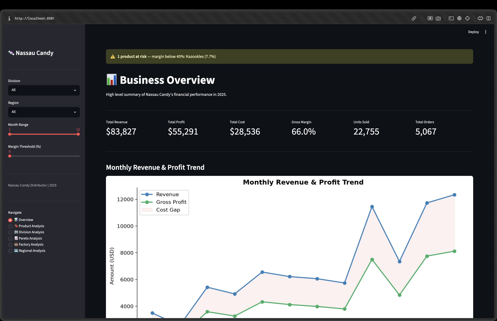
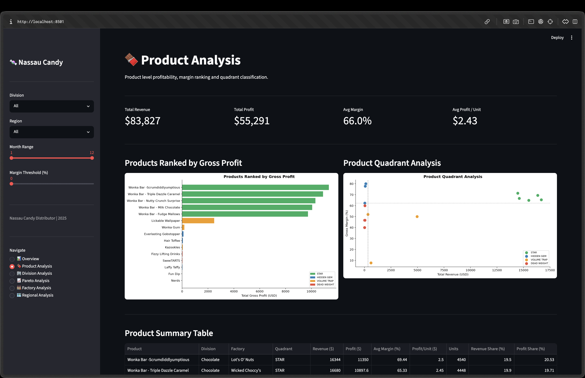
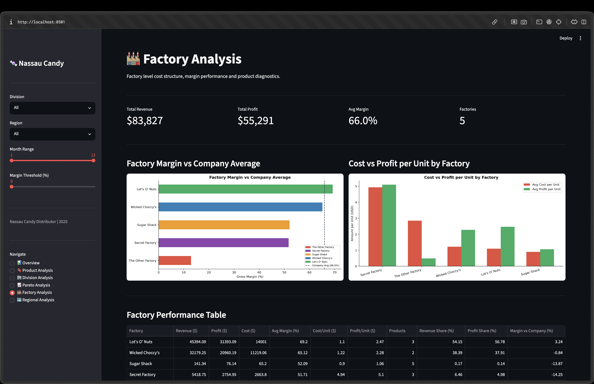

# Nassau Candy Distributor

## Product Line Profitability & Margin Performance Analysis

A end-to-end data analysis project examining product profitability, division performance,
factory cost structure, and regional trends for Nassau Candy Distributor (FY 2025).

---

## Screenshots







---

## Project Structure

```
nassau-candy-analysis/
│
├── data/
│   ├── Nassau_Candy_Distributor.csv      # raw dataset (10,194 rows)
│   ├── nassau_candy_cleaned.csv          # after cleaning & factory mapping
│   └── nassau_candy_enriched.csv         # with KPIs & quadrant classification
│
├── notebooks/
│   ├── 01_data_understanding.ipynb       # shape, nulls, duplicates, integrity check
│   ├── 02_data_cleaning.ipynb            # cleaning log, anomaly flags, factory mapping
│   ├── 03_kpi_calculations.ipynb         # gross margin, profit per unit, contributions
│   ├── 04_product_analysis.ipynb         # rankings, quadrant classification
│   ├── 05_division_analysis.ipynb        # division performance, imbalance analysis
│   ├── 06_pareto_analysis.ipynb          # 80/20 rule, dependency risk
│   ├── 07_factory_analysis.ipynb         # cost diagnostics, factory risk classification
│   ├── 08_business_overview.ipynb        # overview charts (matplotlib/seaborn)
│   ├── 09_product_analysis_charts.ipynb  # product charts
│   ├── 10_division_analysis_charts.ipynb # division charts
│   ├── 11_pareto_analysis_charts.ipynb   # pareto charts
│   ├── 12_factory_analysis_charts.ipynb  # factory charts
│   └── 13_regional_analysis_charts.ipynb # regional charts
│
├── dashboard/
│   ├── app.py                            # main entry point, navigation & filters
│   ├── data/
│   │   └── loader.py                     # data loading, KPI calculation, caching
│   ├── components/
│   │   ├── kpi_cards.py                  # reusable KPI metric cards
│   │   └── charts.py                     # all chart functions
│   └── views/
│       ├── overview.py                   # business overview page
│       ├── product_analysis.py           # product analysis page
│       ├── division_analysis.py          # division analysis page
│       ├── pareto_analysis.py            # pareto analysis page
│       ├── factory_analysis.py           # factory analysis page + map
│       └── regional_analysis.py          # regional analysis page
│
├── outputs/
│   ├── charts/                           # saved chart images (30 charts)
│   └── reports/                          # JSON reports + executive summary
│       ├── data_understanding_report.json
│       ├── data_cleaning_report.json
│       ├── kpi_report.json
│       ├── product_analysis_report.json
│       ├── division_analysis_report.json
│       ├── pareto_analysis_report.json
│       ├── factory_analysis_report.json
│       └── executive_summary.pdf
│
├── src/                                  # reserved for modular source code
├── pyproject.toml                        # project dependencies
└── README.md
```

---

## Setup & Installation

### Prerequisites

- Python 3.10+

### Option A — Using uv (recommended)

```bash
# clone the repo
git clone <your-repo-url>
cd nassau-candy-analysis

# create virtual environment and install dependencies
uv venv
uv add streamlit pandas numpy matplotlib seaborn openpyxl
```

### Option B — Using pip

```bash
# clone the repo
git clone <your-repo-url>
cd nassau-candy-analysis

# create virtual environment
python -m venv .venv

# activate it
source .venv/bin/activate        # mac/linux
.venv\Scripts\activate           # windows

# install dependencies
pip install streamlit pandas numpy matplotlib seaborn openpyxl
```

Run notebooks `01` through `13` in sequence.
Each notebook saves its output to `data/` or `outputs/reports/`.

### 2. Run the Dashboard

```bash
cd dashboard
uv run streamlit run app.py
```

Opens at `http://localhost:8501`

---

## Notebook Guide

| Notebook                      | Purpose                                                                   | Output                     |
| ----------------------------- | ------------------------------------------------------------------------- | -------------------------- |
| `01_data_understanding`       | Explore raw data shape, types, nulls, date range, integrity check         | JSON report                |
| `02_data_cleaning`            | Document every cleaning decision, flag anomalies, add factory mapping     | Cleaned CSV + JSON report  |
| `03_kpi_calculations`         | Calculate gross margin, profit per unit, revenue & profit contribution    | Enriched CSV + JSON report |
| `04_product_analysis`         | Rank products by profit, margin, profit per unit. Classify into quadrants | JSON report                |
| `05_division_analysis`        | Compare divisions by revenue, profit, margin efficiency and imbalance     | JSON report                |
| `06_pareto_analysis`          | Apply 80/20 rule to products, divisions, factories and regions            | JSON report                |
| `07_factory_analysis`         | Diagnose factory cost structure, margin gaps, product-factory linkage     | JSON report                |
| `08_business_overview`        | Monthly trend, quarterly performance, division comparison charts          | 4 charts                   |
| `09_product_analysis_charts`  | Profit ranking, margin ranking, quadrant scatter, revenue vs profit       | 5 charts                   |
| `10_division_analysis_charts` | Donut charts, margin bar, stacked bar, quarterly trend                    | 6 charts                   |
| `11_pareto_analysis_charts`   | Dual axis pareto charts, heatmap, dependency risk bar                     | 4 charts                   |
| `12_factory_analysis_charts`  | Factory margin, cost vs profit, product by factory, heatmap               | 5 charts                   |
| `13_regional_analysis_charts` | Region bars, heatmap, quarterly trend, ship mode distribution             | 6 charts                   |

---

## Dashboard Pages

| Page                 | What It Shows                                                            |
| -------------------- | ------------------------------------------------------------------------ |
| 📊 Overview          | KPI cards, monthly trend, quarterly performance, division summary        |
| 🍫 Product Analysis  | Profit ranking, quadrant scatter, product table, quadrant breakdown      |
| 🏢 Division Analysis | Revenue vs profit, margin comparison, quarterly pivot, imbalance metrics |
| 📈 Pareto Analysis   | Pareto charts, product/division/factory pareto tables, dependency risk   |
| 🏭 Factory Analysis  | Margin vs avg, cost diagnostics, factory map, product-factory breakdown  |
| 🗺️ Regional Analysis | Profit by region, region×division heatmap, ship mode distribution        |

### Dashboard Filters (Sidebar)

All filters apply globally across every page:

- **Division** — filter by Chocolate, Sugar, or Other
- **Region** — filter by Pacific, Atlantic, Interior, or Gulf
- **Month Range** — select any month window within 2025
- **Margin Threshold** — hide products below a minimum margin %

### At-Risk Alert

A warning banner appears above every page whenever a product's average margin
drops below 40% (respects active filters).

### Anomaly Detection

A second banner flags any month where revenue dropped 20% or more vs the
prior month — catches real drops (e.g. the post-September dip) without
flagging normal seasonal upswings.

### Drill-Down

Click a row in the Product Summary Table (Product Analysis page) to see
that product's revenue/profit metrics, monthly trend, and region breakdown
below the table.

### Data Export

Each page's main summary table has a **Download CSV** button for exporting
the currently filtered data.

### Forecast

The Overview page's monthly trend chart projects the next 2 months with a
dashed line, using a simple linear-trend fit on the visible history.

---

## Key Findings Summary

FY2025 only (raw data also contains 2024 orders — excluded from analysis, see Dataset note below).

- **Overall gross margin: 65.96%** across $83,827 in revenue
- **Chocolate division = 94.7% of profit** — critical concentration risk
- **Top 5 products = 94.7% of profit** — bottom 10 products contribute ~5.3%
- **The Other Factory operates at 12.9% margin** vs 65.96% company average
- **Q4 = 37.5% of annual revenue** — heavy seasonal dependency
- **Everlasting Gobstopper has 80% margin** but near-zero scale — biggest growth opportunity

---

## Tools & Libraries

| Tool         | Purpose                    |
| ------------ | -------------------------- |
| Python 3.10+ | Core language              |
| pandas       | Data manipulation          |
| numpy        | Numerical calculations     |
| matplotlib   | Static charts              |
| seaborn      | Statistical visualizations |
| streamlit    | Interactive dashboard      |

---

## Dataset

| Field        | Description                                         |
| ------------ | --------------------------------------------------- |
| Order ID     | Unique order identifier                             |
| Order Date   | Date of order (used for all time analysis)          |
| Division     | Product division — Chocolate, Sugar, Other          |
| Product Name | Product name (15 unique products)                   |
| Sales        | Total sales value                                   |
| Units        | Units sold                                          |
| Gross Profit | Sales minus Cost                                    |
| Cost         | Manufacturing cost                                  |
| Region       | Customer region — Pacific, Atlantic, Interior, Gulf |
| Ship Mode    | Shipping method                                     |

> **Note:** Ship Date column was flagged as anomalous (dates range 2026–2030,
> postdating every order) and excluded from all time-based analysis.
>
> **Note:** The raw file's Order Date actually spans 2024-01-02 to 2025-12-31
> (10,194 rows: 4,181 from 2024, 6,013 from 2025) rather than 2025 alone.
> Since every notebook groups by calendar Month/Quarter without a Year split,
> keeping both years would silently blend two years of orders into the same
> "January" or "Q4" bucket. Cleaning (notebook 02) restricts scope to
> **FY2025 only** (6,013 rows) so all monthly/quarterly/seasonal analysis is
> an accurate single-year read.

---

_FY 2025 | Nassau Candy Distributor | Data Analysis Internship Project_
